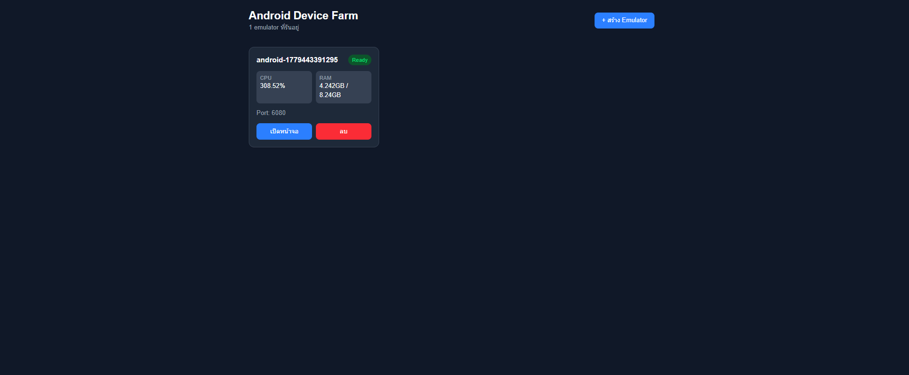
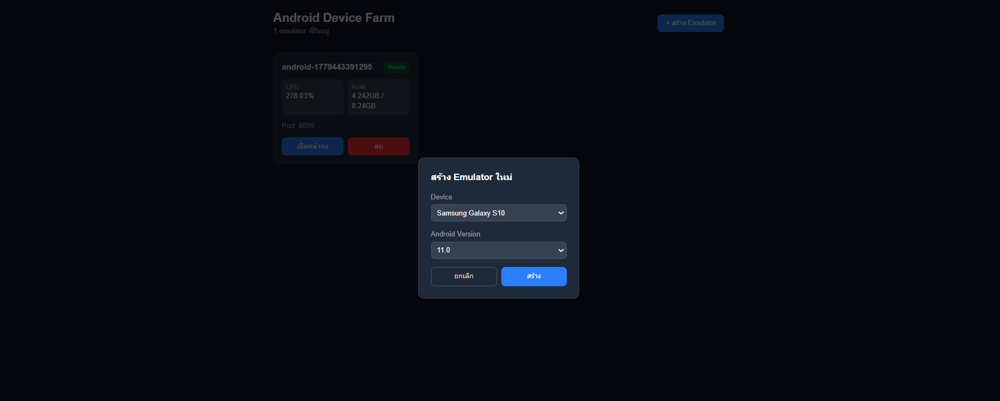
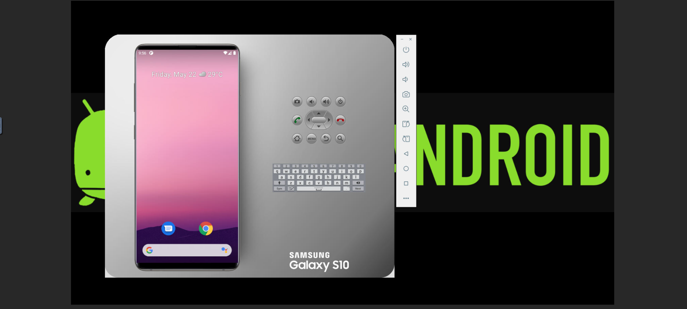

# 🤖 Android Device Farm

A web-based dashboard for managing Android emulators running in Podman containers. Spin up, monitor, and destroy Android emulators directly from your browser — no Android Studio required.

---

## 📸 Screenshots

> Dashboard

<!-- Add screenshot here -->


> Create Emulator Modal

<!-- Add screenshot here -->


> Emulator Screen (noVNC)

<!-- Add screenshot here -->


---

## ✨ Features

- **Spawn & Destroy** emulators via UI — no CLI needed
- **Auto port assignment** — no manual port configuration
- **Boot status indicator** — know when your emulator is ready
- **realtime CPU & RAM monitoring** per container (polling every 5s)
- **Max 3 emulators** — prevents RAM exhaustion
- **Toast notifications** — feedback on every action
- **Dark mode UI** built with Tailwind CSS

---

## 🏗 Architecture

```
Next.js (Frontend + API Routes)
        ↓
Podman CLI (via Node.js child_process)
        ↓
Android Emulator Containers (budtmo/docker-android)
        ↓
noVNC (view emulator screen in browser)
```

---

## 🛠 Tech Stack

| Layer | Technology |
|---|---|
| Frontend | Next.js 15, Tailwind CSS |
| Backend | Next.js API Routes |
| Container Runtime | Podman |
| Android Emulator | budtmo/docker-android |
| Screen Viewing | noVNC |

---

## ⚙️ Prerequisites

- Windows with WSL2 or Linux
- Podman with KVM support
- Node.js 18+

### Verify KVM is available

```bash
ls /dev/kvm
```

---

## 🚀 Getting Started

### 1. Clone the repository

```bash
git clone https://github.com/yourusername/android-farm.git
cd android-farm
```

### 2. Install dependencies

```bash
npm install
```

### 3. Start Podman machine (Windows only)

```powershell
podman machine start
```

### 4. Run the development server

```bash
npm run dev
```

### 5. Open the dashboard

```
http://localhost:3000
```

---

## 📱 Supported Devices & Android Versions

| Device | Android Version |
|---|---|
| Samsung Galaxy S10 | 11.0, 12.0, 13.0 |
| Pixel 4 | 11.0, 12.0, 13.0 |
| Nexus 5 | 11.0, 12.0, 13.0 |

---

## 📁 Project Structure

```
android-farm/
├── app/
│   ├── page.tsx                  # Dashboard UI
│   └── api/
│       └── emulators/
│           ├── route.ts          # GET list, POST spawn
│           └── [id]/
│               └── route.ts     # DELETE destroy
├── components/
│   ├── EmulatorCard.tsx          # Emulator card with stats
│   ├── CreateModal.tsx           # Create emulator modal
│   └── Toast.tsx                 # Toast notification
└── lib/
    └── podman.ts                 # Podman helper functions
```

---

## ⚠️ Limitations

- KVM is required — emulators will be very slow without it
- Each emulator uses ~2-4GB RAM — max 3 emulators enforced
- KVM is only available on Linux or WSL2 (Windows 11)
- First boot takes ~5-10 minutes while pulling the image

---

## 📄 License

MIT